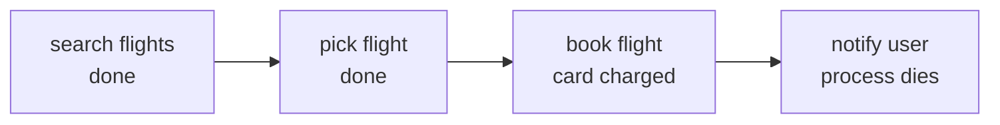
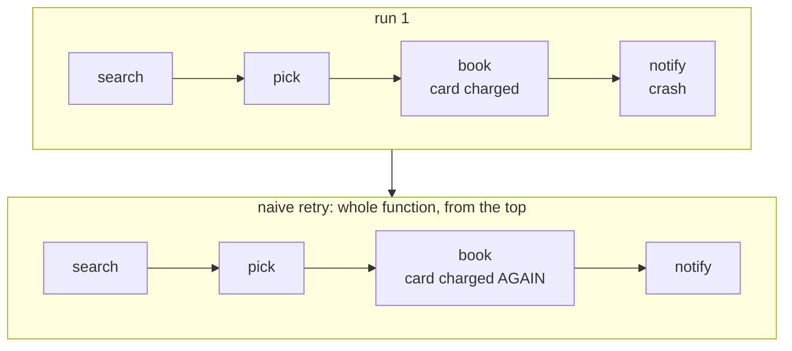
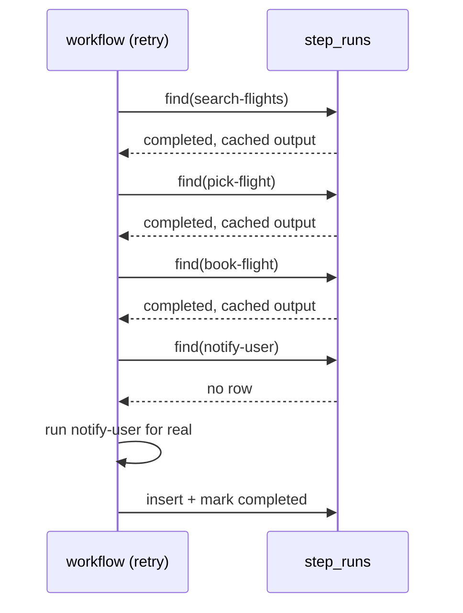
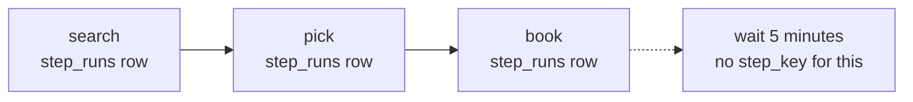

# Memoization Is All the Crash Recovery You Need (Until Your Agent Has to Wait)

*September 2026*

*What happens when step 3 succeeds, step 4 fails, and the money's already gone.*

Say you're building an AI agent that books flights, the kind that decides on its own which tool to call next: search flights, pick the best one, book it, notify the user. Four tool calls, chained by whatever the model decides to do next. Simple enough.

It runs fine, right up until the fourth call. Notify fails. Maybe the email service is down, maybe it's a timeout, doesn't matter. Here's what's already true by the time that failure happens: the flight is booked. The card is charged. And the user has no idea, because the one call that was supposed to tell them is the one that broke.

The real problem is the three steps that already succeeded and can't be undone by trying again.



Three green boxes and one red one. The red one is the only thing that failed, and it's also the only thing the user will ever hear about, if they hear anything at all.

## The naive fix, and watch it fail

The instinct is to wrap the whole thing in a try/catch and retry the function on failure. It's the first thing anyone reaches for, and it's also what most agent frameworks hand you by default: a retry decorator around the whole run loop, same fix, better branding. It's wrong in a way that's easy to miss until you actually trace through what a full-function retry does.

Retry the function, and it starts from the top. Search flights again. Pick the best one again. Book the flight again, which means calling the airline's API again, which means the card gets charged again. You didn't fix the crash. You turned a failed notification into a duplicate booking. If we retry the whole function, it books the flight again, that's the exact failure mode, and it's obvious as soon as you say it out loud instead of just wrapping the try/catch and moving on.

The problem was never "retry." The problem is that retry, applied to the whole function, has no memory of which parts already happened.



Same four calls, run twice. The airline doesn't know this is a retry, it just sees a second booking request and charges the card a second time.

## Memoization gives the retry a memory

So give the retry a memory. Every step's output gets saved somewhere durable, keyed to that step, a run ID plus a step name. Before a step runs, check if that key already has a saved result. If it does, skip the work and hand back what's already there. If it doesn't, run it for real and save what comes out.

The real version has more going on, rate limits, compensation lookups, retry bookkeeping, but strip that away and the actual check underneath is this simple:

```typescript
async run<T>(name: string, fn: () => Promise<T>, opts?: StepOptions<T>): Promise<T> {
  const existing = await stepStore.find(taskId, name);
  if (existing?.status === 'completed') {
    return deserialize(existing.output) as T;   // fn() never runs
  }

  const step = await stepStore.createOrFind(taskId, name, /* input */);
  const result = await fn();
  await stepStore.complete(step.id, result);
  return result;
}
```

Strip the TypeScript away and it's three plain Postgres queries doing the real work:

```sql
-- is this step already done?
SELECT * FROM step_runs WHERE task_id = $1 AND step_key = $2;

-- claim it if not, in one round trip
INSERT INTO step_runs (task_id, step_key, input, started_at)
VALUES ($1, $2, $3, NOW())
ON CONFLICT (task_id, step_key) DO NOTHING
RETURNING *;

-- write the result once fn() finishes
UPDATE step_runs SET output = $1, status = 'completed', completed_at = NOW()
WHERE id = $2;
```

`ON CONFLICT (task_id, step_key) DO NOTHING` only works because of one constraint on the table, `UNIQUE (task_id, step_key)`. A step's identity is a row, and Postgres already knows how to tell you whether a row exists, that's the whole mechanism.

Run a retry against that table and it plays out like this:



Three lookups come back with a finished row and never touch the airline API again. Only `notify-user` does real work, because it's the only key with nothing saved against it.

The lookup and the claim above are two separate calls. There's a window between "check if this exists" and "insert if it doesn't" where two concurrent attempts at the same step could race each other into it. `ON CONFLICT DO NOTHING` is what closes that: whichever attempt loses the insert just reads back what the winner wrote, instead of ending up with a duplicate row or an error.

This is also why systems built this way don't usually bother with a separate retry loop for each step. If one step fails, there's nothing wrong with just retrying the whole function from the top, with backoff, the same way you'd retry any failed call. Memoization is what makes that cheap: search and pick and book all "run" again in the sense that the code executes, but each one just returns its cached row instead of doing the work over. Retrying a step and retrying the whole task end up being the same safe operation.

I also got something wrong out loud while working through this, and I'd rather leave it in than clean it up after the fact. I said a step "returns from memory." That's backwards. Memory is exactly what a crash destroys, whatever's sitting in a variable is gone the instant the process dies. What survives is whatever got written to durable storage before that, a row in a table. The word I wanted was storage, not memory. The whole point of the mechanism is that it doesn't trust anything the process remembers.

## Where memoization's power actually stops

Most explanations stop at "steps get memoized" and leave it there. But there's a real limit to this, and it's worth seeing clearly.

A step gets memoized because it has a key: a task ID plus a step name. That key is what a row in the table gets saved under.

Now add a `wait 5 minutes` to the workflow. Or a `wait for the user to click confirm`, which might not resolve for a day. Neither of those is a step. Neither has a name you could save a row under. There's nothing to key.

In an AI agent, this shows up as human-in-the-loop approval. The agent wants to call a tool, but pauses so a person can approve it first. That pause isn't a tool call. It isn't a step. Memoization has no row for it either.

Here's what that looks like as a chain of rows:



Three steps, three rows. Then a wait, with nothing to attach a row to.

Compare that to what an event log looks like, one row per thing that happened instead of one row per named step:

**an event log, one row per thing that happened (illustrative):**

| seq | event | payload |
|---|---|---|
| 1 | ActivityStarted | search |
| 2 | ActivityCompleted | search |
| 3 | ActivityStarted | pick |
| 4 | ActivityCompleted | pick |
| 5 | TimerStarted | 5m |
| 6 | TimerFired | |

The `step_runs` rows you just saw only have room for named steps. A wait isn't a named step, so it has nowhere to go. This shape doesn't care what something is called, it just records what happened, in order, so a timer firing is just one more line. That's the real difference: one system remembers steps, the other remembers everything that happened.

## What Temporal does instead

Temporal takes a different approach entirely. Instead of a table of completed steps, it keeps a full history of everything that happened in a workflow: every call, every timer, every signal.

Think bank statement, not balance. A balance just tells you what you have right now, and every transaction overwrites it. A statement keeps every transaction, so you can always work out what you had last Tuesday by replaying them.

On every replay, Temporal reruns your workflow code from the top. Every time it hits a call to an activity, it checks the history first: a completed event for that call means it returns the cached result instantly, no event means it runs for real and appends a new one. Same two branches as memoization. But now a timer or a signal is just another entry in that history, not something the system has no place for.

This only works if your code is deterministic. If a replay makes a different sequence of calls than the original run did, the history stops lining up, and a cached result meant for one call gets handed to a different one.

I got the name wrong at first too. I called it a write-ahead log. Wrong term, a WAL is Postgres's own internal mechanism. What Temporal keeps is an event log, event sourcing, same neighborhood, not the same thing.

Lined up side by side, the two approaches this whole post has been comparing:

| | Memoization | Replay |
|---|---|---|
| Stores | one row per completed step | every event, in order |
| On retry | look up the row, skip or run | rerun the code, replay the history |
| A timer or signal | nothing to attach it to | just another event |
| Requires | a stable step key | deterministic code |

## The takeaway

Forget which tool we're talking about. Here's what to actually ask about anything that claims "durable execution," Temporal, Inngest, or something you build yourself:

- Can it handle a timer or a wait, or only a finished step?
- Does it notice if your code changed since the last run, or does it just trust the cache?
- When it resumes, does it rerun your code and skip the cached parts, or rebuild everything from history without touching your code at all?

This applies the same way whether your own code is deciding what happens next or an LLM is picking which tool to call. Most tools land somewhere different on all three, and most people comparing them don't know which answers they're actually getting. "It has crash recovery" sounds like one feature. It's really three separate decisions, and a tool can be great at one and blind to another. A tool can memoize steps perfectly and still have nothing for timers. A tool can replay full history and still break the moment your code isn't deterministic. Knowing which of the three you're getting is what keeps you from being surprised by it in production.
